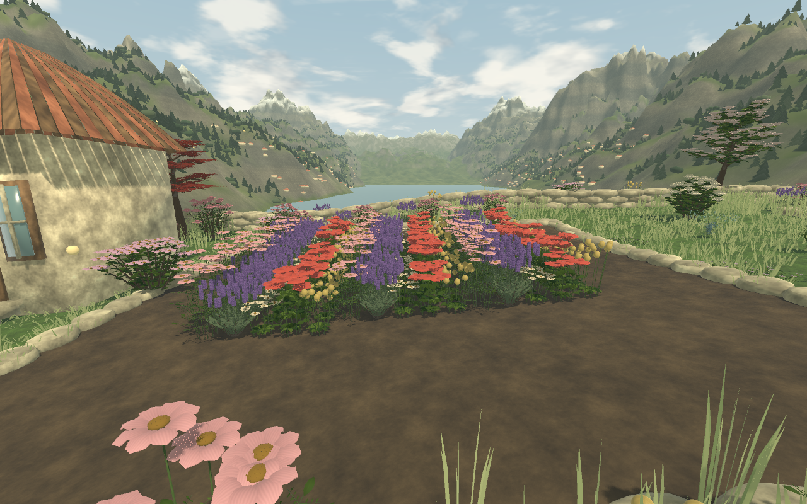

# Zend Garden

**A quiet place to plant, grow, and make your own.**

[**Enter the garden →**](https://zend.garden)

Zend Garden is a cosy, first-person gardening game beside a mountain lake. Start with a small patch of soil, wander among the flowers, and gradually turn your corner of the valley into somewhere you want to spend time.

Grow a cottage garden full of roses and jasmine, make a bamboo retreat, plant an orchard, or fill your beds with vegetables. Shape the ground, lay winding paths and find a spot for a bench overlooking the water. Seasons, changing weather, birdsong and gentle music give the garden its own rhythm.

There is no need to keep up. Plants do not die from neglect, requests have no deadlines, and your garden waits while the game is closed. Spend a few minutes tending a bed or settle in for a longer afternoon of planting and exploring.

## Make a garden that feels like yours

- **Choose from 218 plants.** Flowers, grasses and groundcover, shrubs, trees, Australian natives, produce, and a dedicated cacti and succulents category give you plenty of ways to mix colour, height and shape. Discover several bamboo varieties, giant and coast redwoods, snow gums, fruit trees, roses, jasmine and hemp, alongside ten more ornamental grasses, twenty cacti and succulents, artichokes, rhubarb, asparagus, broccoli, cauliflower, capsicum, Brussels sprouts and leeks.
- **Fill the garden with flowers.** Ten additional orchid types, fifteen wildflowers, twenty-five cottage-garden favourites and twenty flowering bushes join the collection. Browse Orchids, Wildflowers, Cottage flowers and Flowering bushes, and sort every plant by height in either direction to plan layered planting.
- **Explore ten new garden trails.** Follow the eastern path or open Garden atlas to discover wetland, fern, limestone, meadow, orchard, kitchen, glasshouse, stream, alpine and moon gardens. Visit every area from the start, then earn its free milestone reward to plant, tend and arrange it. Guide and Garden atlas show all ten targets and live progress. Each has different scenery, growing benefits and activities, with eighteen additional collection plants to discover.
- **Build a working garden.** Turn spare harvest into compost, castings, mulch and starter mix; collect rain, adjust shade and seasonal shelter, and feed visiting birds. Plant individual pockets in eight kinds of container, including hanging baskets, vertical walls and tiered displays. Move entire planted containers or store their plants safely when packing them away.
- **Build layers of planting.** Combine low plants, flowers, shrubs and trees in the same space. The detailed models have distinct leaves, petals, fruit and bark, so each part of the garden has its own character.
- **Tend it your way.** Hold left click and sweep to water the soil for a temporary 20% growth boost. Prune, move and rearrange plants as your ideas change. Upgrade your tools, adjust the pruning square, or hold Gather and sweep across an area to collect all the plants that are ready—even when they share a square.
- **Shape the landscape.** Use the hoe to raise or lower ground and ease a hillside into a flatter planting space. Rake paths through the lawn and connect your favourite corners.
- **Add places to linger.** Choose benches, lanterns, pots, ponds, bird baths, beehives, arbors, pergolas and a greenhouse. Write your own garden signs and make the place feel personal.
- **Welcome a little wildlife.** Watch birds, bees, butterflies, lady beetles and other visitors, and spend time with your animal companions. Different planting and garden features bring different visitors.
- **Grow at your own pace.** Earn petals through gathering and garden requests, discover more seeds and unlock more space. Move on to the next morning whenever you are ready.
- **Enjoy the view.** Press H or choose Enjoy the view to hide the HUD and held tool; press any key or click/tap to return. Look out over the lake and wooded mountain slopes, listen to the garden's changing soundscape, or use photo mode to explore and capture a favourite scene.

## Your first visit

Open [Zend Garden in your browser](https://zend.garden) and choose **Enter the garden**. Allow time for the first download, which includes the game's detailed models and artwork.

Use the **arrow keys** to walk and the **mouse** to look around. Press **Tab** to open the garden menus, choose some seeds, and click on a planting spot. Water your new plants, explore the shop, or press **G** to welcome the next morning.

| Key | What it does |
| --- | --- |
| **↑ ← ↓ →** or **W A S D** | Walk around |
| **Mouse** | Look around |
| **Tab** | Open menus or return to the garden |
| **Left click** | Use your selected tool; hold and sweep to water or gather |
| **1–9** | Choose a tool |
| **[ / ]** with pruners | Make the pruning square smaller or larger within your upgrades |
| **R** with the hoe | Switch between raising and lowering ground |
| **G** | Go to the next morning |
| **P** | Open photo mode |
| **H** | Enjoy the view with HUD and held tool hidden; any key or click/tap returns |
| **Escape** | Open settings or leave the current view |

The game also has touch controls, with options for control size and a left-handed layout. Settings let you adjust sound, camera sensitivity, reduced motion and graphics quality. See the [player guide](docs/player-guide.md) for the full controls, tool tips, shop details and saving help.

## Come back when you feel like it

Your garden saves as you play. In the browser, it stays with the same browser, device and site address; it does not sync between devices. Use **Save garden** before closing the tab, and remember that clearing site data removes the garden saved there. In **Settings**, choose **Download save file** to keep a JSON copy or move your garden to another browser or device. Choose **Upload save file…** on the destination, check the day and plant count, then confirm. The garden it replaces is kept as a backup; **Download previous garden** lets you retrieve that copy.

Zend Garden is still growing. It is free to play, with source available for noncommercial use, and feedback helps shape what comes next. If something feels confusing, breaks, or sparks an idea, [tell us on GitHub](https://github.com/Tam-mas/ZendGarden/issues). A screenshot and a description of what happened are always helpful.

Want to explore how the game is made, run it on your computer, contribute, or host your own version? Visit the [development guide](docs/development.md) or [hosting guide](docs/cloudflare-pages.md). Code and original game assets are shared under the [Zend Garden Free Play and Share-Alike Licence](LICENSE). Distributed and publicly hosted derivatives must remain free to play and provide their complete corresponding source under the same terms. See [licensing details](LICENSING.md), including the permissions retained by earlier MIT releases.
