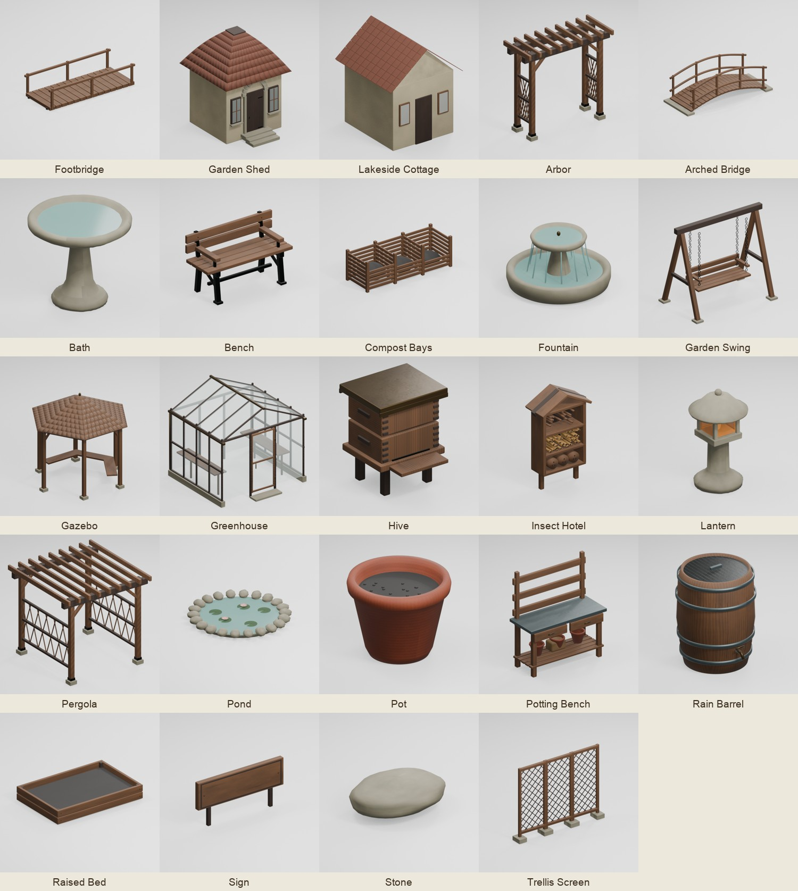
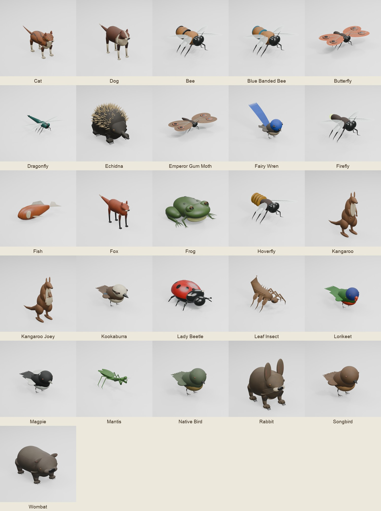

# Garden model overhaul

Created on `codex/blender-garden-model-overhaul` through the connected Blender MCP. All models are original project assets and use the repository licence. The dedicated garden scenes preserve unrelated scenes and selections in the interactive Blender session.

This library supplies 21 placeable structures, 26 animal models, three permanent scenery models, and the upgraded environment. Existing furniture kind names, catalogue order and saved garden coordinates remain compatible. The ten new furnishing kinds are appended to the catalogue.

The first realism/material prototypes (cat, kookaburra and bench) are described in
[`REALISM.md`](REALISM.md), alongside the anatomy, grooming, baking and performance
work needed for a complete realism pass. Six generated source textures and their exact
built-in image-generation prompts are preserved in `textures/generated/`. These prototypes
do not imply that every animal has already received a finished anatomical sculpt.





## Editable sources

| Library | Contents |
| --- | --- |
| `structures.blend` | Eleven existing structures and ten new structures, arranged in a gallery |
| `animals.blend` | Cat, dog, rabbit, two kangaroo variants, echidna, wombat, fox, six birds, frog, fish and ten insects |
| `scenery.blend` | Garden shed, straight footbridge and lakeside cottage |
| `environment.blend` | Upgraded shed, limestone walls and distant cottages within the existing landscape |

The existing structure silhouettes guide their replacements: shallow arbor, deeper pergola, pitched greenhouse, flat-topped hive, round stone-edged pond and turned birdbath. New models add a potting bench, compost bays, rain barrel, raised bed, trellis screen, hexagonal gazebo, arched bridge, tiered fountain, garden swing and insect hotel. The gazebo and swing support the existing rest interaction; the insect hotel attracts small visitors. Other new furnishings are decorative rather than new resource systems.

Wood, stone, plaster, clay, metal, coats, feathers, scales and insect cuticle have colour, roughness and normal maps. The packed source maps live under `textures/`; this folder is ignored by Godot and excluded from the web export. Shipped GLBs embed their textures, using JPEG compression. The environment shed consolidates its 462 authored pieces into eight material batches; landscape chunk names and geometry remain intact. Each individual structure/animal stays below 65,000 triangles; `manifest.json` records the current dimensions, mesh count, triangle count, byte size and clips.

## Movement and visiting habits

The animals contain named NLA clips exported as glTF animations. `GardenArt.detailed_model` promotes the asset wrapper and rewrites private animation paths while preserving shared meshes and textures. It removes root-transform tracks, leaving navigation responsible for world position. `GardenAnimalMotion` advances clips explicitly and blends pose changes.

Walking quadrupeds use alternating diagonal steps with knee flexion, a planted portion of each step, an arcing recovery and counter-rotating ankles. Their walk rates are matched to travel speed. Birds have folded rest poses, separate wrists, delayed wing recovery, gripping toes, drinking, bathing and foraging clips. Fish have tail and fin movement and are displayed as smaller pond fish. Rabbits and kangaroos use hop clips; companions retain invitations, petting, stretches, sniffing and settling.

| Visitor | Game routine |
| --- | --- |
| Echidna | Methodical walking; stops and draws in when approached |
| Wombat | Slow, lumbering dusk visits at 0.28 metres per second |
| Fox | Rare, brief dusk sightings beyond the garden; retreats from an approaching player |
| Fairy-wren | Low foraging or a perch near native planting |
| Kookaburra | Occasional morning arrival, a still perch, then departure |
| Rainbow lorikeet | Coordinated paired visits where flowers and trees grow |
| Australian magpie | Walking and foraging on the lawn |
| Blue-banded bee | Solitary flower circuits with feeding stops |
| Hoverfly | Holds position, then makes a short sideways dart |
| Mantis | Mostly still on grassy stems, with small head movements |
| Spiny leaf insect | Gentle leaf-like sway near native planting |
| Emperor gum moth | Evening flights around a lantern; no adult nectar-feeding routine |

Review GIFs in `previews/` come from the actual imported clips in Godot. Their playback is slowed for inspection. The still review sheets come from importing the exported GLBs into isolated Blender studio scenes.

## Rebuilding and review

`build.py` is the sequential maintenance entry point for the same MCP-authored models. `art_source/rebuild.sh` invokes it after rebuilding the landscape and botanicals, so the legacy generators cannot silently replace this overhaul. Run Blender subprocesses with normal OS access on this Mac, as required by the project execution notes.

```sh
/Applications/Blender.app/Contents/MacOS/Blender --background --python art_source/overhaul/build.py
/Applications/Godot.app/Contents/MacOS/Godot --headless --path . --editor --import
/Applications/Godot.app/Contents/MacOS/Godot --headless --path . --script tools/export_shop_models.gd
/Applications/Godot.app/Contents/MacOS/Godot --path . --script tools/render_ornament_cards.gd
```

For an interactive MCP rebuild, add this directory to Blender's Python path and call `mcp_run.run(category, kinds)`. It restores the active scene, selection and active object after each sequential batch. Never open these libraries over another unsaved scene simply to rebuild them.

Validation includes self-contained exports, UVs and triangle budgets (`tests/check_assets.py`), all 13 source libraries and packed images (`tests/check_blender_sources.py`, run in background Blender), animation targets, world-position ownership, ankle articulation, planted foot contact and visitor traits (`tests/overhaul_models.gd`), plus the normal game suite (`tests/run.sh`). `tools/review_overhaul_motion.gd` renders six representative clips in the game renderer.
